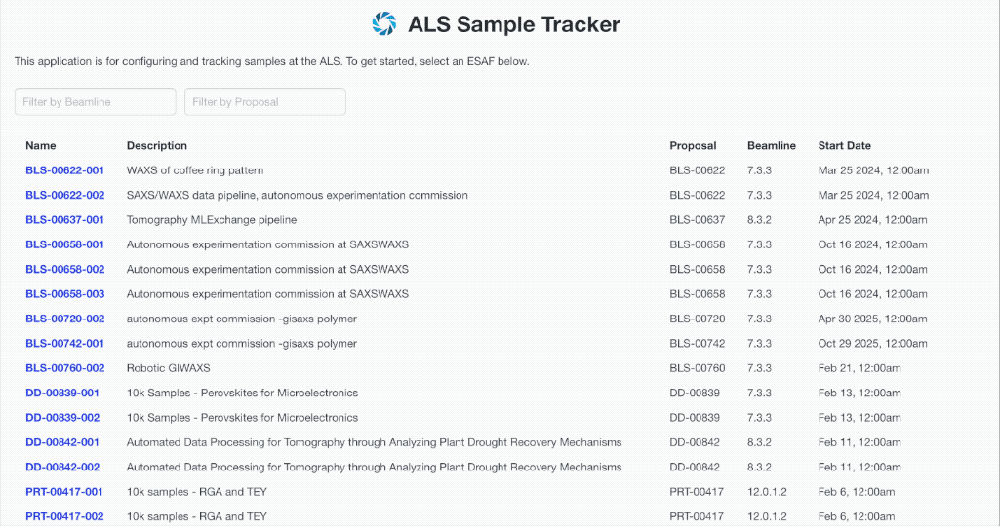
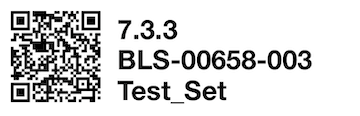
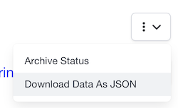
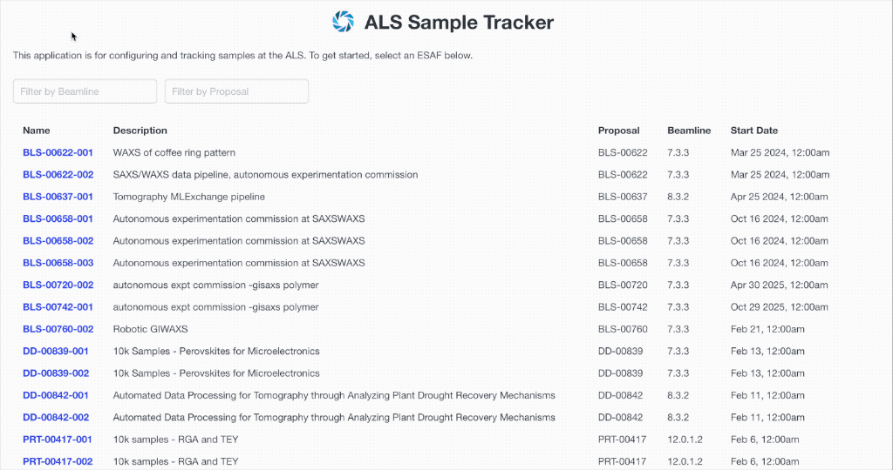

# ALS Sample Tracker

The Sample Tracker is a web service you can use to manage the samples you'll be scanning at the ALS.

It lives here:  https://sample-tracker.dataportal.als.lbl.gov/

A test version you can mess around in lives here:  https://sample-tracker.dataportal-staging.als.lbl.gov/

## Visiting scientists

You can organize samples in groups, and enter scan parameters and other metadata for them.



You can print out QR code labels that link back to the Sample Tracker, and stick the labels on your samples:



You can also download the data you entered, as a JSON-format file:



## Beamline managers

If you're registered by the User Office as the manager of a beamline, you can edit the Parameters and Scan Types for it, defining what data the users are required to enter per sample:



You can define multiple Scan Types, each with a subset of your Parameters.  Parameters can have validation logic, and can be edited as text, pulldown menus, or free-form text in a dialog box.

All the data your users enter is available using an API, so you can automatically fetch it at the beamline.

```python
test_qr_code = "https://sample-tracker.dataportal.als.lbl.gov/set/bls-00658-003-test_set"

client = SampleTrackerClient(url, user, password)

one_set = client.set_get_by_qr_code(test_qr_code)
samples = client.sample_get_by_set(ones_et.slug)

print(f"Found {len(samples)} samples in Set {one_set.name}.")
```

A Python version of the API client is included in the <a href="https://github.com/als-computing/beamline-data-toolkit">ALS Computing Beamline Toolkit</a> repository, with plenty of examples.  In addition to reading existing data, you can also use the client to create and edit samples.

```python
scan_type_slug = scan_types_by_name["GIWAXS"].slug
new_sample = SampleCreateDto(
    slug_set=new_set_result.slug,
    name="Test Sample",
    description="This is a test sample created via the Sample Tracker API.",
    slug_scan_type=scan_type_slug,
)
new_sample_result = client.sample_create(new_sample)
```

So, if you have an automated process that creates samples and generates its own metadata, you can feed it into the Sample Tracker, where it can exist alongside user-entered values.

## To get access

If you have an ORCID account and you're on an ESAF, you already have access.  Go to the site, choose the ESAF you're working with, and add your samples.

If you have an ORCID account and you're the manager of a beamline, you already have admin access for that beamline.  Go to the site and select it, and start defining your Scan Types and Parameters.